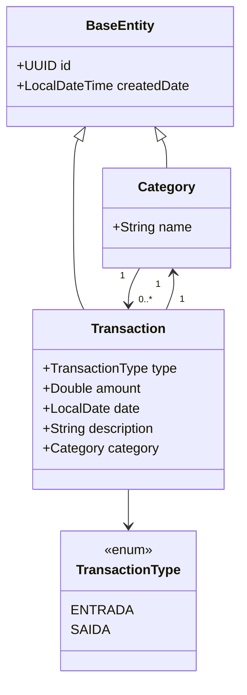

# FinTrack

FinTrack é uma API REST para controle de finanças pessoais, desenvolvida para facilitar o acompanhamento de receitas e despesas de forma simples e organizada. 

O projeto foi pensado para pessoas que costumam ter dificuldade ou falta de tempo para registrar manualmente seus gastos, oferecendo um sistema que centraliza transações por categorias e permite visualizar melhor como o dinheiro está sendo utilizado ao longo do tempo. 

---

## Tecnologias

* Java 21
* Spring Boot
* Spring MVC
* Spring Data JPA (Hibernate)
* PostgreSQL
* Flyway
* Docker
* Maven
* Bean Validation

---

## Diagrama de Classes (Domínio da API)



## ▶️ Como executar

### Clonar o projeto

```bash
git clone https://github.com/caiotelesz/fintrack.git
```

### Entrar na pasta

```bash
cd fintrack
```

### Subir o PostgreSQL

```bash
docker compose up -d
```

### Executar a aplicação

```bash
./mvnw spring-boot:run
```

---
